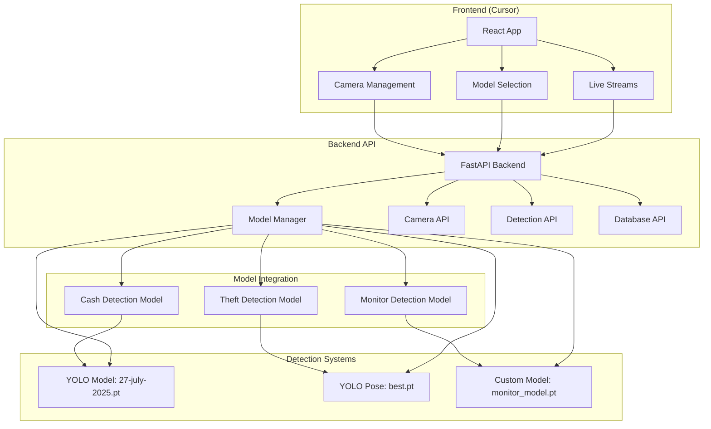

# 🚀 Sakshi.Ai Cursor Development Guide

## 📋 Overview

This guide explains how to run and develop Sakshi.Ai in Cursor IDE, with special focus on the backend's dynamic model selection and YOLO model integration.

## 🏗️ System Architecture in Cursor

### Backend-Model Integration Flow



## 🚀 Quick Start in Cursor

### 1. Open Project in Cursor

```bash
# Open Cursor and navigate to Sakshi.Ai project
cd /path/to/Sakshi.Ai
cursor .
```

### 2. Start Development Environment

```bash
# Start the backend API
cd backend
python -m uvicorn main:app --reload --host 0.0.0.0 --port 5000

# In another terminal, start the frontend
cd frontend
npm start
```

### 3. Access the Application

- **Frontend**: `http://localhost:3000`
- **Backend API**: `http://localhost:5000`
- **API Docs**: `http://localhost:5000/docs`

## 🔧 Backend Model Integration

### Model Configuration System

The backend now includes a comprehensive model management system:

```python
# Model configurations for each detection system
MODEL_CONFIGS = {
    'cash_detector': {
        'model_path': '/app/Cash_Detection_Docker/27-july-2025.pt',
        'model_type': 'yolo',
        'classes': ['cash', 'bill', 'money'],
        'confidence_threshold': 0.55,
        'frame_skip': 3
    },
    'theft_detector': {
        'model_path': '/app/yolo-pose-shoplifting/models/best.pt',
        'model_type': 'yolo_pose',
        'classes': ['person', 'shoplifting', 'suspicious'],
        'confidence_threshold': 0.6,
        'frame_skip': 2
    },
    'monitor_detector': {
        'model_path': '/app/monitor_detection_system/monitor_model.pt',
        'model_type': 'custom',
        'classes': ['monitor_on', 'monitor_off'],
        'confidence_threshold': 0.7,
        'frame_skip': 5
    }
}
```

### Dynamic Model Selection

When a user selects a specific model in the frontend:

1. **Frontend sends request** to backend with model selection
2. **Backend validates** the model exists and is accessible
3. **Backend updates** camera configuration with model settings
4. **Backend restarts** the detection container with new model
5. **Detection system** loads the selected YOLO model

### API Endpoints for Model Management

```bash
# Get available models
GET /api/models/available

# Get model info for specific app
GET /api/apps/{app_name}/model-info

# Start app with model validation
POST /api/apps/{app_name}/start

# Get app status with model info
GET /api/apps/status
```

## 📊 Model Integration Flow

### 1. User Selects Model in Frontend

```javascript
// Frontend sends model selection
const response = await fetch('/api/apps/cash_detector/start', {
    method: 'POST',
    headers: {
        'Content-Type': 'application/json'
    },
    body: JSON.stringify({
        model_config: {
            confidence_threshold: 0.55,
            frame_skip: 3
        }
    })
});
```

### 2. Backend Validates Model

```python
def validate_model_path(app_name: str) -> bool:
    """Validate that the model file exists for the app"""
    model_config = MODEL_CONFIGS.get(app_name)
    if not model_config:
        return False
    
    model_path = model_config['model_path']
    
    # Check if model file exists
    if os.path.exists(model_path):
        logger.info(f"Model found for {app_name}: {model_path}")
        return True
    else:
        logger.warning(f"Model not found for {app_name}: {model_path}")
        return False
```

### 3. Backend Updates Camera Configuration

```python
def update_app_cameras_config(app_name: str, cameras: List[str]):
    """Update camera configuration for specific apps with model integration"""
    app_dir = APP_DIRS.get(app_name)
    
    # Get model configuration
    model_config = MODEL_CONFIGS.get(app_name, {})
    
    # Update cameras.json for the app
    cameras_config = []
    for camera in camera_store:
        if camera.name in cameras and camera.enabled:
            cameras_config.append({
                "id": camera.name,
                "name": camera.name,
                "location": camera.location,
                "rtsp_url": camera.rtsp_url,
                "enabled": camera.enabled,
                "model_config": model_config  # Include model config
            })
    
    # Add global settings with model configuration
    config_data = {
        "cameras": cameras_config,
        "settings": {
            "frame_skip": model_config.get('frame_skip', 3),
            "confidence_threshold": model_config.get('confidence_threshold', 0.5),
            "model_path": model_config.get('model_path', ''),
            "model_type": model_config.get('model_type', ''),
            "classes": model_config.get('classes', [])
        }
    }
```

### 4. Detection System Loads Model

The detection systems (Cash, Theft, Monitor) read the updated `cameras.json` and load the specified YOLO model:

```python
# In detection system (e.g., cash_detector.py)
def load_model():
    with open('cameras.json', 'r') as f:
        config = json.load(f)
    
    model_path = config['settings']['model_path']
    model_type = config['settings']['model_type']
    confidence_threshold = config['settings']['confidence_threshold']
    
    # Load YOLO model
    model = YOLO(model_path)
    return model, confidence_threshold
```

## 🔍 Testing Model Integration

### 1. Test Model Availability

```bash
# Check available models
curl http://localhost:5000/api/models/available

# Expected response:
{
    "cash_detector": {
        "model_path": "/app/Cash_Detection_Docker/27-july-2025.pt",
        "model_type": "yolo",
        "classes": ["cash", "bill", "money"],
        "exists": true,
        "size_mb": 5.2,
        "app_status": "stopped"
    },
    "theft_detector": {
        "model_path": "/app/yolo-pose-shoplifting/models/best.pt",
        "model_type": "yolo_pose",
        "classes": ["person", "shoplifting", "suspicious"],
        "exists": true,
        "size_mb": 8.1,
        "app_status": "stopped"
    }
}
```

### 2. Test Model Selection

```bash
# Start cash detector with model validation
curl -X POST http://localhost:5000/api/apps/cash_detector/start

# Check app status with model info
curl http://localhost:5000/api/apps/cash_detector/model-info
```

### 3. Test Camera-Model Integration

```bash
# Add camera with specific model
curl -X POST http://localhost:5000/api/cameras \
  -H "Content-Type: application/json" \
  -d '{
    "name": "Test Camera",
    "rtsp": "rtsp://test-url",
    "apps": ["cash_detector"],
    "model_config": {
      "confidence_threshold": 0.6,
      "frame_skip": 2
    }
  }'
```

## 🛠️ Development Workflow in Cursor

### 1. Backend Development

```bash
# Start backend with auto-reload
cd backend
python -m uvicorn main:app --reload --host 0.0.0.0 --port 5000

# Test API endpoints
curl http://localhost:5000/api/health
```

### 2. Frontend Development

```bash
# Start frontend development server
cd frontend
npm start

# The frontend will automatically reload on changes
```

### 3. Model Development

```bash
# Test model loading
python -c "
from ultralytics import YOLO
model = YOLO('Cash_Detection_Docker/27-july-2025.pt')
print('Model loaded successfully')
"
```

### 4. Database Development

```bash
# Connect to PostgreSQL
psql -h localhost -U sakshi_user -d sakshi_ai_db

# Check tables
\dt

# Check detections
SELECT * FROM detections LIMIT 5;
```

## 🔧 Configuration Files

### 1. Environment Variables

Create `.env` file in backend directory:

```bash
# Database Configuration
DB_HOST=localhost
DB_PORT=5432
DB_NAME=sakshi_ai_db
DB_USER=sakshi_user
DB_PASSWORD=sakshi_password

# Telegram Configuration
TELEGRAM_BOT_TOKEN=your_bot_token
TELEGRAM_CHAT_ID=your_chat_id

# GPU Configuration
NVIDIA_VISIBLE_DEVICES=all
CUDA_VISIBLE_DEVICES=0
```

### 2. Model Configuration

The backend automatically manages model configurations through `MODEL_CONFIGS`:

```python
# Add new model
MODEL_CONFIGS['new_detector'] = {
    'model_path': '/app/new_detector/model.pt',
    'model_type': 'yolo',
    'classes': ['object1', 'object2'],
    'confidence_threshold': 0.5,
    'frame_skip': 3
}
```

## 📊 Monitoring and Debugging

### 1. Backend Logs

```bash
# View backend logs
tail -f backend/logs/app.log

# Check model loading logs
grep "Model found" backend/logs/app.log
```

### 2. Model Performance

```bash
# Check GPU usage
nvidia-smi

# Monitor model inference
watch -n 1 'nvidia-smi --query-gpu=utilization.gpu,memory.used --format=csv'
```

### 3. Database Monitoring

```bash
# Check detection logs
psql -h localhost -U sakshi_user -d sakshi_ai_db -c "
SELECT detection_type, COUNT(*) as count, 
       AVG(confidence) as avg_confidence
FROM detections 
GROUP BY detection_type;
"
```

## 🚨 Troubleshooting

### 1. Model Not Found

```bash
# Check model file exists
ls -la Cash_Detection_Docker/27-july-2025.pt

# Validate model path in backend
curl http://localhost:5000/api/models/available
```

### 2. Model Loading Errors

```bash
# Test model loading manually
python -c "
from ultralytics import YOLO
try:
    model = YOLO('Cash_Detection_Docker/27-july-2025.pt')
    print('Model loaded successfully')
except Exception as e:
    print(f'Error: {e}')
"
```

### 3. Backend Connection Issues

```bash
# Check backend status
curl http://localhost:5000/api/health

# Check database connection
psql -h localhost -U sakshi_user -d sakshi_ai_db -c "SELECT 1;"
```

## 🎯 Best Practices

### 1. Model Management

- **Version Control**: Keep model files in version control
- **Model Validation**: Always validate models before deployment
- **Performance Monitoring**: Monitor model inference performance
- **Backup Models**: Keep backup copies of important models

### 2. Development Workflow

- **Test Locally**: Always test model integration locally first
- **Incremental Testing**: Test each component separately
- **Logging**: Use comprehensive logging for debugging
- **Documentation**: Document model configurations and changes

### 3. Performance Optimization

- **GPU Memory**: Monitor GPU memory usage
- **Batch Processing**: Optimize batch sizes for your GPU
- **Model Quantization**: Consider model quantization for faster inference
- **Caching**: Cache model predictions when appropriate

## 📈 Advanced Features

### 1. Model Switching

The backend supports dynamic model switching:

```python
# Switch model for an app
@app.post("/api/apps/{app_name}/switch-model")
def switch_model(app_name: str, model_config: ModelConfig):
    # Validate new model
    if not validate_model_path(app_name):
        raise HTTPException(400, "Model not found")
    
    # Update model configuration
    MODEL_CONFIGS[app_name].update(model_config.dict())
    
    # Restart app with new model
    restart_app(app_name)
    
    return {"message": f"Switched model for {app_name}"}
```

### 2. Model Performance Analytics

```python
@app.get("/api/models/performance")
def get_model_performance():
    """Get performance metrics for all models"""
    performance_data = {}
    
    for app_name in MODEL_CONFIGS:
        # Get inference time, accuracy, etc.
        performance_data[app_name] = {
            "avg_inference_time": get_avg_inference_time(app_name),
            "accuracy": get_model_accuracy(app_name),
            "total_detections": get_total_detections(app_name)
        }
    
    return performance_data
```

---

**Sakshi.Ai** - Empowering Security with AI in Cursor 🚀

This guide provides everything you need to develop and run Sakshi.Ai in Cursor with full model integration and dynamic model selection capabilities. 
