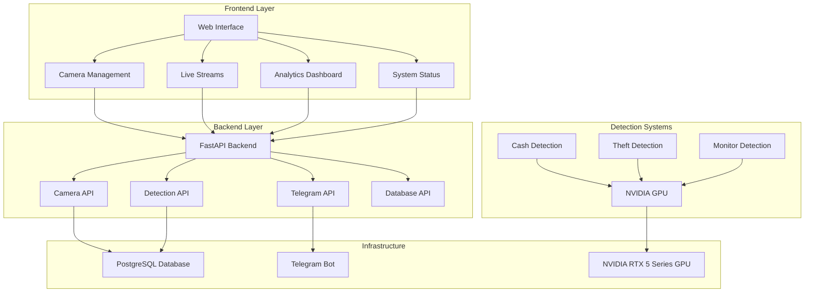
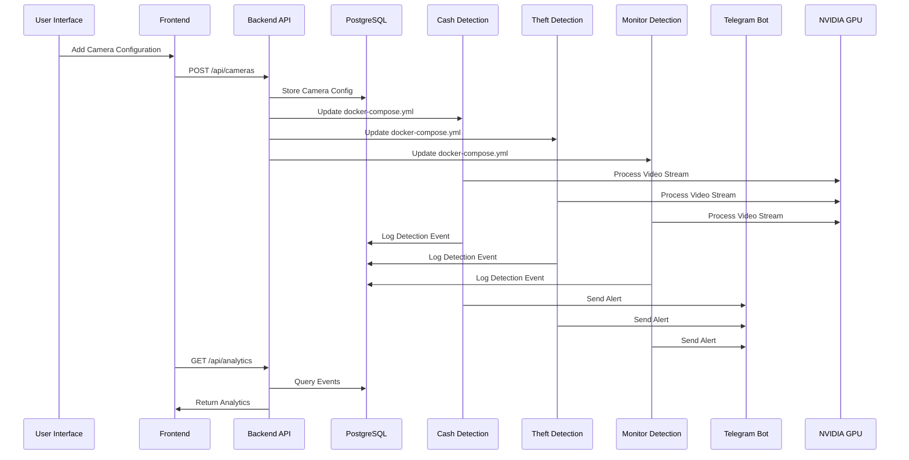
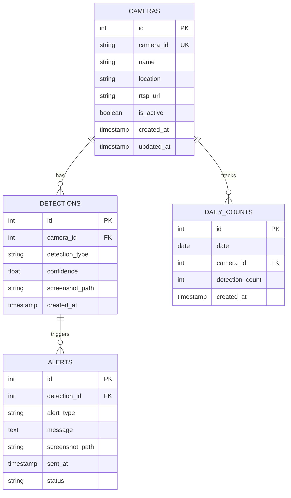
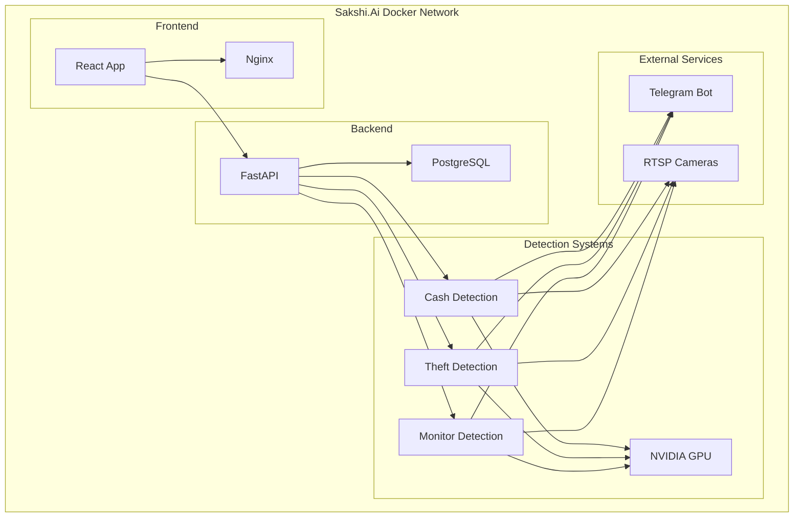

# 🚀 Sakshi.Ai - AI-Powered Security Surveillance System

## 📋 Overview

Sakshi.Ai is a comprehensive AI-powered security surveillance system that integrates three specialized detection applications:

1. **💰 Cash Detection System** - Detects cash transactions and suspicious activities
2. **🛒 Theft Detection System** - Identifies shoplifting and suspicious behaviors  
3. **🖥️ Monitor Detection System** - Detects when monitors are turned off

## 🏗️ System Architecture



## 🔄 Data Flow



## 🎯 Features

### 🔧 Core Features
- **Multi-Camera Support**: Handle multiple RTSP streams simultaneously
- **NVIDIA GPU Acceleration**: RTX 5 series optimized performance
- **Real-time Detection**: Live video processing with AI models
- **Database Integration**: PostgreSQL for event logging and analytics
- **Telegram Notifications**: Instant alerts with screenshots
- **Web Dashboard**: Modern React-based management interface

### 📊 Detection Capabilities
- **Cash Detection**: Identify cash transactions and suspicious activities
- **Theft Detection**: Detect shoplifting using YOLO pose estimation
- **Monitor Detection**: Detect when monitors are turned off
- **Multi-View Support**: 1, 2, 4, 6, or 8 camera layouts

### 🛡️ Security Features
- **Duplicate Prevention**: Avoid spam alerts for same events
- **Cooldown Periods**: Configurable detection intervals
- **Screenshot Capture**: Evidence collection for all detections
- **Daily Reports**: Automated summary reports via Telegram

## 🚀 Quick Start

### Prerequisites
- Ubuntu 20.04+ with NVIDIA RTX 5 series GPU
- 8GB+ RAM
- 50GB+ storage
- Internet connection

### 1. Automated Deployment
```bash
# Download and run the deployment script
wget https://raw.githubusercontent.com/your-repo/sakshi-ai/main/deploy_sakshi_ai.sh
chmod +x deploy_sakshi_ai.sh
./deploy_sakshi_ai.sh
```

### 2. Manual Setup
```bash
# Clone the repository
git clone https://github.com/your-repo/sakshi-ai.git
cd sakshi-ai

# Run deployment script
./deploy_sakshi_ai.sh
```

### 3. Configuration
```bash
# Update Telegram credentials
nano /opt/sakshi-ai/.env

# Start the system
sudo systemctl start sakshi-ai

# Check status
sudo systemctl status sakshi-ai
```

## 📱 Web Interface

### Access Points
- **Frontend Dashboard**: `http://your-server-ip:3000`
- **Backend API**: `http://your-server-ip:5000`

### Dashboard Features
1. **Camera Management**: Add/remove RTSP cameras
2. **App Selection**: Choose detection systems per camera
3. **Live Streams**: Multi-view camera feeds
4. **Analytics**: Real-time detection statistics
5. **System Status**: Monitor all services

## 🔧 System Management

### Service Commands
```bash
# Start Sakshi.Ai
sudo systemctl start sakshi-ai

# Stop Sakshi.Ai
sudo systemctl stop sakshi-ai

# Check status
sudo systemctl status sakshi-ai

# Enable auto-start
sudo systemctl enable sakshi-ai
```

### Health Monitoring
```bash
# Run health check
/opt/sakshi-ai/health_check.sh

# View logs
docker-compose logs -f

# Check GPU status
nvidia-smi
```

## 📊 API Endpoints

### Camera Management
```bash
# Get all cameras
GET /api/cameras

# Add camera
POST /api/cameras
{
  "name": "Camera Name",
  "rtsp": "rtsp://url",
  "apps": ["cash_detector", "theft_detector"]
}

# Update cameras
PUT /api/cameras

# Delete camera
DELETE /api/cameras/{name}
```

### Detection Systems
```bash
# Start camera processing
POST /api/start_camera/{name}

# Stop camera processing
POST /api/stop_camera/{name}

# Get analytics
GET /api/analytics
```

## 🗄️ Database Schema



## 🔄 Docker Architecture



## 🛠️ Configuration

### Environment Variables
```bash
# Database
DB_HOST=localhost
DB_PORT=5432
DB_NAME=sakshi_ai_db
DB_USER=sakshi_user
DB_PASSWORD=sakshi_password

# Telegram
TELEGRAM_BOT_TOKEN=your_bot_token
TELEGRAM_CHAT_ID=your_chat_id

# GPU
NVIDIA_VISIBLE_DEVICES=all
CUDA_VISIBLE_DEVICES=0
```

### Camera Configuration
```json
{
  "cameras": [
    {
      "id": "camera_1",
      "name": "Main Entrance",
      "location": "Front Door",
      "rtsp_url": "rtsp://username:password@ip:port/stream",
      "enabled": true
    }
  ],
  "settings": {
    "frame_skip": 3,
    "confidence_threshold": 0.55,
    "detection_timeout": 10
  }
}
```

## 🔍 Troubleshooting

### Common Issues

1. **GPU Not Detected**
   ```bash
   nvidia-smi
   docker run --rm --gpus all nvidia/cuda:11.8-base-ubuntu20.04 nvidia-smi
   ```

2. **Database Connection Failed**
   ```bash
   sudo systemctl status postgresql
   sudo -u postgres psql -c "\l"
   ```

3. **Telegram Notifications Not Working**
   ```bash
   # Check credentials in .env file
   cat /opt/sakshi-ai/.env
   ```

4. **Camera Stream Issues**
   ```bash
   # Test RTSP stream
   ffplay rtsp://your-camera-url
   ```

### Log Locations
```bash
# Application logs
docker-compose logs -f

# System logs
sudo journalctl -u sakshi-ai -f

# GPU logs
nvidia-smi -l 1
```

## 📈 Performance Optimization

### GPU Optimization
- **CUDA Version**: 12.1+ for RTX 5 series
- **Memory Management**: Automatic GPU memory allocation
- **Batch Processing**: Optimized for multiple camera streams

### Network Optimization
- **RTSP Buffering**: Configurable buffer sizes
- **Frame Skipping**: Adjustable for performance
- **Compression**: Optimized video compression

### Database Optimization
- **Indexing**: Automatic index creation
- **Connection Pooling**: Efficient database connections
- **Query Optimization**: Optimized analytics queries

## 🔒 Security Considerations

### Network Security
- **Firewall Configuration**: Automatic port management
- **HTTPS Support**: SSL/TLS encryption
- **Access Control**: User authentication system

### Data Security
- **Encrypted Storage**: Database encryption
- **Secure Communication**: API authentication
- **Audit Logging**: Complete activity tracking

## 📞 Support

### Documentation
- **User Manual**: `/opt/sakshi-ai/USER_MANUAL.md`
- **API Documentation**: `http://your-server-ip:5000/docs`
- **Health Check**: `/opt/sakshi-ai/health_check.sh`

### Contact
- **GitHub Issues**: [Report Issues](https://github.com/your-repo/sakshi-ai/issues)
- **Documentation**: [Full Documentation](https://github.com/your-repo/sakshi-ai/wiki)

## 📄 License

This project is licensed under the MIT License - see the [LICENSE](LICENSE) file for details.

## 🤝 Contributing

1. Fork the repository
2. Create a feature branch
3. Make your changes
4. Add tests
5. Submit a pull request

---

**Sakshi.Ai** - Empowering Security with AI 🚀 
