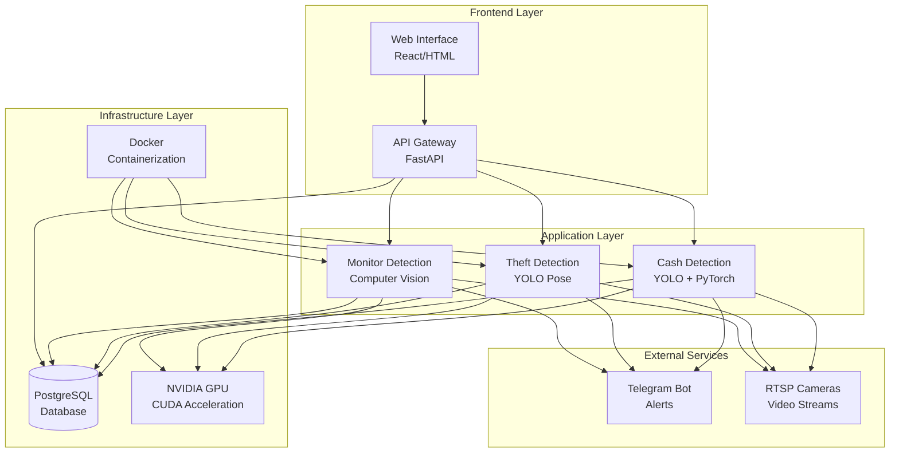
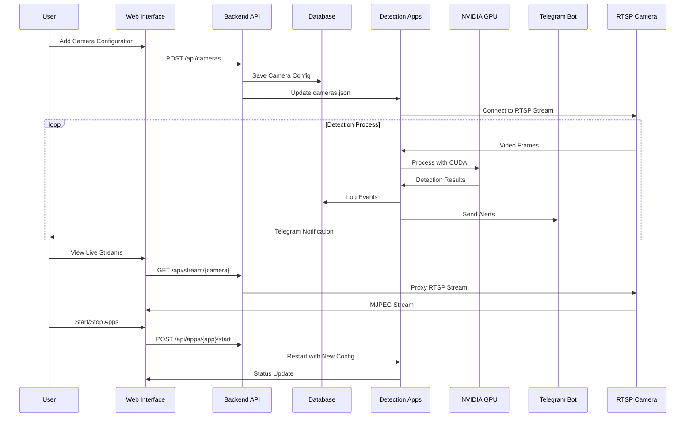
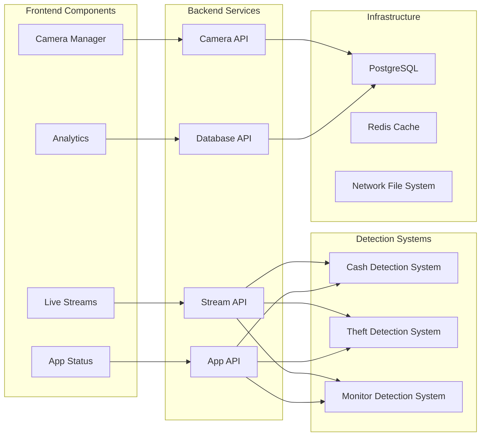

# Sakshi.Ai - AI-Powered Surveillance System

A comprehensive AI-powered surveillance system that integrates multiple detection applications with a unified web interface for camera management, live streaming, and analytics.

## 🏗️ System Architecture



## 🔄 Data Flow Diagram



## 🏛️ Component Architecture



## 🚀 Features

### Core Applications
- **Cash Detection System** - Detects cash transactions and suspicious activities
- **Theft Detection System** - Detects shoplifting and suspicious behavior using pose estimation
- **Monitor Detection System** - Detects monitor on/off states with 10-second cooldown

### Unified Frontend
- **Camera Management** - Add, edit, and configure RTSP cameras with app selection
- **Live Streaming** - Multi-layout live stream viewer (1, 2, 4, 6, 8 views)
- **App Status Monitoring** - Real-time status of all detection applications
- **Analytics Dashboard** - Comprehensive analytics and reporting
- **Real-time Alerts** - Telegram integration for instant notifications

### Technical Features
- **NVIDIA GPU Acceleration** - CUDA-enabled detection for optimal performance
- **Multi-RTSP Support** - Handle multiple camera streams simultaneously
- **PostgreSQL Database** - Robust data storage and logging
- **Docker Containerization** - Easy deployment and scaling
- **Real-time Streaming** - Live video feeds with fullscreen support

## 📁 Project Structure

```
Sakshi.Ai/
├── frontend/                 # React-based unified web interface
│   ├── public/
│   │   └── index.html       # Static HTML frontend
│   ├── src/                 # React components (if using React)
│   ├── docker-compose.yml   # Frontend + Backend + Database
│   ├── Dockerfile          # Frontend container
│   └── nginx.conf          # Nginx configuration
├── backend/                  # FastAPI backend service
│   ├── main.py              # API endpoints and logic
│   ├── requirements.txt     # Python dependencies
│   ├── database/init.sql   # Database schema
│   └── Dockerfile          # Backend container
├── Cash_Detection_Docker/   # Cash detection application
│   ├── main_docker.py      # Cash detection logic
│   ├── cameras.json        # Camera configuration
│   ├── config.env          # Environment variables
│   ├── requirements_docker.txt
│   ├── Dockerfile          # CUDA-enabled container
│   └── docker-compose.yml  # Cash detection services
├── yolo-pose-shoplifting/  # Theft detection application
│   ├── main_docker.py      # Theft detection logic
│   ├── cameras.json        # Camera configuration
│   ├── config.env          # Environment variables
│   ├── requirements_docker.txt
│   ├── Dockerfile          # CUDA-enabled container
│   └── docker-compose.yml  # Theft detection services
├── monitor_detection_system/ # Monitor detection application
│   ├── main_docker.py      # Monitor detection logic
│   ├── cameras.json        # Camera configuration
│   ├── config.env          # Environment variables
│   ├── requirements_docker.txt
│   ├── Dockerfile          # CUDA-enabled container
│   └── docker-compose.yml  # Monitor detection services
├── scripts/
│   └── deploy.sh           # Ubuntu deployment script
└── README.md               # This file
```

## 🛠️ Quick Start

### Prerequisites
- Ubuntu 20.04+ or similar Linux distribution
- NVIDIA GPU with CUDA support (recommended)
- Internet connection for package downloads

### 1. Automated Deployment (Recommended)

```bash
# Clone the repository
git clone <repository-url>
cd Sakshi.Ai

# Make the deployment script executable
chmod +x scripts/deploy.sh

# Run the automated deployment
./scripts/deploy.sh
```

### 2. Manual Installation

#### Step 1: Install System Dependencies
```bash
# Update system
sudo apt update && sudo apt upgrade -y

# Install Docker
curl -fsSL https://get.docker.com -o get-docker.sh
sudo sh get-docker.sh
sudo usermod -aG docker $USER

# Install Docker Compose
sudo curl -L "https://github.com/docker/compose/releases/download/v2.20.0/docker-compose-$(uname -s)-$(uname -m)" -o /usr/local/bin/docker-compose
sudo chmod +x /usr/local/bin/docker-compose

# Install NVIDIA Docker (if GPU available)
distribution=$(. /etc/os-release;echo $ID$VERSION_ID)
curl -s -L https://nvidia.github.io/nvidia-docker/gpgkey | sudo apt-key add -
curl -s -L https://nvidia.github.io/nvidia-docker/$distribution/nvidia-docker.list | sudo tee /etc/apt/sources.list.d/nvidia-docker.list
sudo apt update
sudo apt install -y nvidia-docker2
sudo systemctl restart docker
```

#### Step 2: Clone and Start the System
```bash
# Clone repository
git clone <repository-url>
cd Sakshi.Ai

# Start the unified system
cd frontend
docker-compose up -d --build
```

#### Step 3: Access the Web Interface
Open your browser and navigate to `http://localhost:3000`

## 🎯 Usage Guide

### Camera Management
1. **Add Cameras**: Click "Add Camera" and fill in:
   - Camera Name (unique identifier)
   - RTSP URL (camera stream URL)
   - Location (optional description)
   - Select detection apps (Cash, Theft, Monitor)
   - Enable/disable camera

2. **Edit Cameras**: Click the edit icon on any camera card to modify settings

3. **Delete Cameras**: Click the delete icon to remove cameras

### Live Streaming
1. **Select Layout**: Choose from 1, 2, 4, 6, or 8 view layouts
2. **Choose Cameras**: Select cameras for each view position
3. **Start Streams**: Click the play button on each camera to start streaming
4. **Fullscreen**: Click the fullscreen icon for individual camera views

### App Status Management
1. **View Status**: See real-time status of all detection applications
2. **Start/Stop Apps**: Control individual applications
3. **Monitor Cameras**: View which cameras are connected to each app
4. **View Details**: Click settings icon for detailed app information

### Analytics Dashboard
- **Key Metrics**: View total detections, alerts, cameras, and running apps
- **Trends**: Analyze detection patterns over time
- **Distribution**: See detection distribution across applications
- **Hourly Activity**: Monitor activity patterns throughout the day

## 🔧 Configuration

### Environment Variables
The system uses the following environment variables:

```bash
# Database
DB_HOST=localhost
DB_PORT=5432
DB_NAME=sales_purchase_db
DB_USER=postgres
DB_PASSWORD=postgres

# Telegram (for alerts)
TELEGRAM_BOT_TOKEN=your_bot_token
TELEGRAM_CHAT_ID=your_chat_id

# GPU Configuration
NVIDIA_VISIBLE_DEVICES=all
CUDA_VISIBLE_DEVICES=0
```

### Camera Configuration
Cameras are configured through the web interface with:
- **Name**: Unique identifier
- **RTSP URL**: Camera stream URL
- **Location**: Physical location description
- **Apps**: Selected detection applications
- **Enabled**: Active/inactive status

## 📊 Database Schema

### Cameras Table
```sql
CREATE TABLE cameras (
    id SERIAL PRIMARY KEY,
    name VARCHAR(255) UNIQUE NOT NULL,
    rtsp_url TEXT NOT NULL,
    location VARCHAR(255),
    enabled BOOLEAN DEFAULT true,
    apps JSONB DEFAULT '[]',
    created_at TIMESTAMP DEFAULT CURRENT_TIMESTAMP,
    updated_at TIMESTAMP DEFAULT CURRENT_TIMESTAMP
);
```

### Detection Events Tables
Each detection system has its own events table:
- `cash_events` - Cash detection events
- `theft_events` - Theft detection events  
- `monitor_events` - Monitor detection events

### Daily Counts Table
```sql
CREATE TABLE daily_counts (
    id SERIAL PRIMARY KEY,
    date DATE DEFAULT CURRENT_DATE,
    camera_name VARCHAR(255),
    event_type VARCHAR(50),
    count INTEGER DEFAULT 0,
    UNIQUE(date, camera_name, event_type)
);
```

## 🔌 API Endpoints

### Camera Management
- `GET /api/cameras` - Get all cameras
- `POST /api/cameras` - Add new camera
- `PUT /api/cameras/{name}` - Update camera
- `DELETE /api/cameras/{name}` - Delete camera

### App Management
- `GET /api/apps/status` - Get app statuses
- `POST /api/apps/{app_name}/start` - Start app
- `POST /api/apps/{app_name}/stop` - Stop app

### Streaming
- `GET /api/stream/{camera_name}` - Get camera stream
- `GET /api/stream/config` - Get stream configuration
- `PUT /api/stream/config` - Update stream configuration

## 🚨 Individual Applications

### Cash Detection System
```bash
cd Cash_Detection_Docker
docker-compose up -d --build
```

### Theft Detection System
```bash
cd yolo-pose-shoplifting
docker-compose up -d --build
```

### Monitor Detection System
```bash
cd monitor_detection_system
docker-compose up -d --build
```

## 🔍 Monitoring and Troubleshooting

### Logs
```bash
# Frontend logs
docker-compose logs frontend

# Backend logs
docker-compose logs backend

# Database logs
docker-compose logs postgres

# Individual app logs
docker-compose logs cash_detector
docker-compose logs theft_detector
docker-compose logs monitor_detector
```

### Health Check
```bash
curl http://localhost:8001/api/health
```

### GPU Status
```bash
# Check NVIDIA GPU
nvidia-smi

# Check Docker GPU support
docker run --rm --gpus all nvidia/cuda:11.8.0-base-ubuntu20.04 nvidia-smi
```

### Common Issues
1. **Port Conflicts**: Ensure ports 3000, 8001, and 5434 are available
2. **GPU Issues**: Verify NVIDIA Docker runtime is installed
3. **Database Connection**: Check PostgreSQL container is running
4. **RTSP Streams**: Verify camera URLs are accessible
5. **Permission Issues**: Ensure user is in docker group

## 📈 Performance Optimization

### GPU Acceleration
- Ensure NVIDIA Docker runtime is installed
- Use CUDA-enabled base images
- Monitor GPU utilization with `nvidia-smi`
- Optimize batch processing for detection models

### Database Optimization
- Regular database maintenance
- Index optimization
- Connection pooling
- Regular backups

### Network Optimization
- Use local RTSP streams when possible
- Optimize video quality settings
- Monitor bandwidth usage
- Use hardware acceleration for video processing

## 🔐 Security Considerations

- Change default database passwords
- Use secure RTSP URLs with authentication
- Implement proper firewall rules
- Regular security updates
- Monitor access logs
- Use HTTPS for web interface
- Implement user authentication

## 🤝 Contributing

1. Fork the repository
2. Create a feature branch
3. Make your changes
4. Test thoroughly
5. Submit a pull request

## 📄 License

This project is licensed under the MIT License - see the LICENSE file for details.

## 📞 Support

For support and questions:
- Create an issue in the repository
- Check the troubleshooting section
- Review the API documentation
- Check system logs for errors

---

**Sakshi.Ai** - Empowering surveillance with AI technology 
